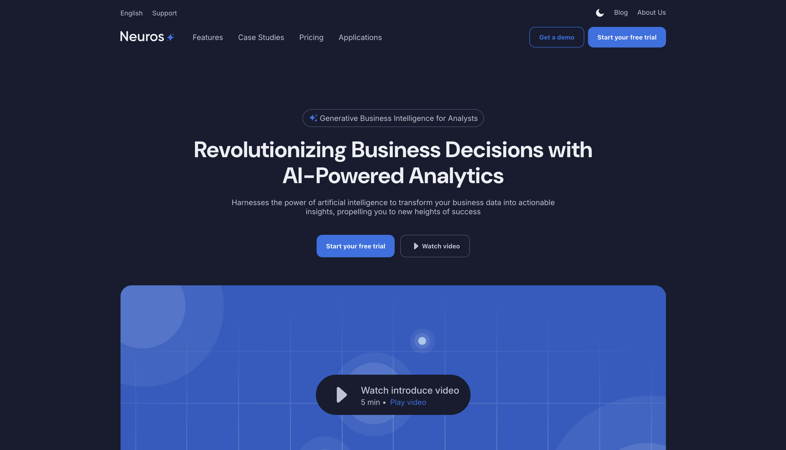

# Neuros — SaaS Landing Page

Адаптивный лендинг для AI-powered продукта **Neuros**, 
свёрстанный по [шаблону из Figma](https://www.figma.com/design/7AB2YR50LvQxws4MKD3M4I/SaaS-Landing-Page-Template---Neuros-Lite-AI-Powerd-product--Community-?node-id=223-63937&t=RymRep2K3bsEHNvI-0).



## ✨ Особенности

- Чистая и семантическая верстка (HTML5, CSS3)
- Адаптив под ширины:
  - 💻 1200px+
  - 📱 811–1199px
  - 📱 до 810px
- Поддержка **тёмной / светлой темы**:
  - переключатель на кнопке
  - сохранение выбора в `localStorage`
  - fallback на системный `prefers-color-scheme`
- Анимации с помощью **GSAP**
- Карусель отзывов на **Swiper.js**
- Аккордеон FAQ с плавными анимациями
- Грид с «расширением» и кнопкой *Explore more application*

## 🛠️ Стек

- **HTML5**
- **CSS3** (Grid, Flexbox, custom properties)
- **JavaScript (ES6+)**
- [GSAP 3](https://greensock.com/gsap/) — анимации
- [Swiper 11](https://swiperjs.com/) — слайдер отзывов

## 📂 Структура проекта

SaaSLanding/  
│  
├── index.html  
├── css/  
│   ├── variables.css   # шрифты, цветовые переменные  
│   ├── base.css        # базовые стили, ресеты  
│   └── layout.css      # стили секций  
├── js/  
│   ├── theme.js        # переключение темы  
│   └── script.js       # анимации GSAP, аккордеон FAQ, раскрытие grid  
├── assets/             # изображения, иконки, svg  
└── fonts/              # Inter, DM Sans  

## 🔧 Запуск

1. Клонируйте репозиторий:
   ```bash
   git clone https://github.com/thepolonsky/SaaSLanding.git

2.	Откройте index.html в браузере — всё работает без сборки.

3.	Для деплоя на GitHub Pages:
	•	в настройках репозитория → Pages → Source = main / root
	•	получите ссылку вида https://thepolonsky.github.io/SaaSLanding/

📄 Лицензия

MIT — используйте свободно, указывая авторство шаблона в Figma.

👨‍💻 Верстка: ThePolonsky
🎨 Дизайн: Neuros Lite AI Powered product — Figma Community Template

